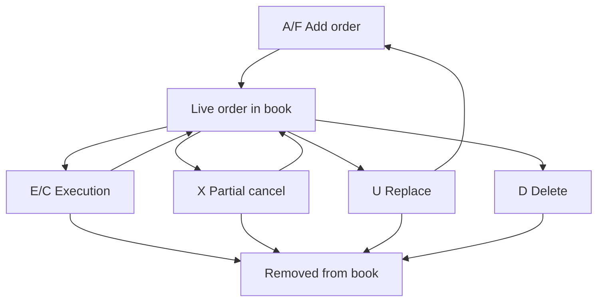

# messages.hpp 设计说明：ITCH 5.0 报文对象模型

本文专门解释 `include/messages.hpp` 的设计思路。它不是 Nasdaq 规范的逐字翻译，而是面向后续订单簿重构、成交分析、日志检查的工程说明。

文件位置：

```text
include/messages.hpp
```

相关辅助头文件：

```text
include/message_types.hpp
include/message_accessors.hpp
```

## 1. 这个文件解决什么问题

ITCH 原始二进制报文是 wire format：

```text
2-byte length + message body
```

message body 中每个字段都有固定 offset、固定字节数，并且整数都是 big-endian。

`messages.hpp` 做的是另一件事：定义解析后的 C++ 语义对象。

例如原始 `A` 报文里，价格是 4 字节 big-endian integer；解析后变成：

```cpp
u32 price;
```

原始股票代码是 8 字节右侧空格填充；解析后仍保存成固定长度字段：

```cpp
Stock stock;  // FixedAscii<8>
```

所以这里的 struct 不追求和二进制报文等长，也不追求内存布局和报文一致。它的目标是：

```text
保留 wire format 中的定长 ASCII 语义
更容易测试
更容易日志检查
更容易传给后续订单簿/统计模块
```

当前项目里，`Message` 解析后的配套辅助层是：

```text
message_types.hpp      type -> expected_length / name / tag
message_accessors.hpp  统一访问 Message variant 上的 type / stock_locate / timestamp
```

这样工具层不需要在多个地方重复写 `std::visit`。

## 2. 整体设计原则

### 2.1 每种 ITCH 消息一个 struct

Nasdaq ITCH 5.0 中每种消息类型都有一个对应 struct，例如：

```text
S -> SystemEvent
R -> StockDirectory
A -> AddOrder
D -> OrderDelete
```

这样做的好处是类型清晰：

```cpp
AddOrder msg;
msg.order_reference_number;
msg.price;
```

不会把不同消息的字段混在一起。

### 2.2 公共字段内联到每个消息

大多数 ITCH 消息开头都有相同布局：

```text
offset 0: message type        1 byte
offset 1: stock locate        2 bytes
offset 3: tracking number     2 bytes
offset 5: timestamp           6 bytes
```

早期版本曾经把这些字段抽成 `CommonFields common`。现在为了让 `Message` 这个 `std::variant` 压到 64 bytes，我们把公共字段直接内联到每个消息，并按对齐友好的顺序排列：

```cpp
struct AddOrder {
  u64 timestamp;
  u64 order_reference_number;
  u32 shares;
  u32 price;
  Stock stock;
  u16 stock_locate;
  u16 tracking_number;
  char type;
  char buy_sell_indicator;
};
```

这样做的好处：

```text
保留 type/stock_locate/tracking_number/timestamp 的完整审计信息
减少 CommonFields 自身 padding 对消息大小的影响
字段名仍然统一，例如 msg.timestamp、msg.stock_locate
当前平台下 sizeof(Message) = 64 bytes
```

代价是每个 struct 都会重复声明公共字段；但对这个解析库来说，64-byte variant 和更稳定的内存布局更有价值。


### 2.3 使用 u8/u16/u32/u64

项目中定义了 Rust 风格整数别名：

```cpp
u16 stock_locate;
u32 price;
u64 timestamp;
```

这比 `std::uint32_t` 更短，适合二进制解析代码。

注意：这些类型表示解析后的本机端序数值，不表示原始字节序。

### 2.4 使用 FixedAscii<N> 表示定长 ASCII 字段

ITCH 中很多字符字段都是定长 ASCII，并且右侧空格填充，例如：

| 业务字段 | 类型别名 | 长度 |
|---|---:|---:|
| `stock` | `Stock` | 8 |
| `mpid` | `MPID` | 4 |
| `attribution` | `Attribution` | 4 |
| `reason` | `Reason` | 4 |
| `issue_sub_type` | `IssueSubType` | 2 |

代码中使用：

```cpp
template <std::size_t N>
struct FixedAscii {
  std::array<char, N> bytes;
  std::string_view raw() const;
  std::string_view trimmed() const;
};
```

这样 parser 会原样保留空格填充，不做 trim。formatter 或上层业务需要展示时再调用 `.trimmed()`。

这么做的好处：

```text
Message 对象固定大小
不依赖 std::string 的短字符串优化
不产生堆分配
保留原始定长字段语义
```

### 2.5 使用 std::variant 表示任意消息

最后定义：

```cpp
using Message = std::variant<
    SystemEvent,
    StockDirectory,
    ...
    UnknownMessage,
    MalformedMessage>;
```

这表示 `parse_message_body` 返回的结果可能是任何一种具体 ITCH 消息。文件读取场景中，`FrameReader` 先给出 `MessageBodyView`，再交给 `parse_message_body(view)` 解析。

在当前离线测试阶段，`std::variant` 的好处是：

```text
类型安全
日志和测试方便
不用继承/虚函数
Message alternative 内部不使用堆对象
新增消息类型时编译器能帮忙检查
```

后续如果做极致性能订单簿重建，可以再增加 callback parser 热路径。

## 3. 内联公共字段

字段说明：

| 字段 | 含义 |
|---|---|
| `type` | ITCH 消息类型，例如 `A`、`R`、`S` |
| `stock_locate` | 当日证券定位码，用于快速定位股票 |
| `tracking_number` | Nasdaq 内部追踪编号 |
| `timestamp` | 当日午夜以来的纳秒数 |

交易知识：

`stock_locate` 是 ITCH 里非常重要的性能设计。真实高频系统不希望每条消息都拿 8 字节股票代码做字符串比较，所以 Nasdaq 在每天开盘前通过 `R` 消息给每只股票分配一个小整数。后续大部分消息只靠这个整数识别证券。

注意：

```text
stock_locate 当日有效，跨交易日不能复用。
```

当前模型保留 `type` 和 `tracking_number`，是为了让日志、审计和异常定位更方便。真正的订单簿热路径以后可以再定义一个更小的 callback parser，不必把这些字段全部物化成对象。

## 4. 系统和主数据消息

### 4.1 SystemEvent

```cpp
struct SystemEvent {
  u64 timestamp;
  u16 stock_locate;
  u16 tracking_number;
  char type;
  char event_code;
};
```

消息类型：`S`

用途：表示交易日和系统状态的关键节点。

常见 `event_code`：

| code | 含义 |
|---|---|
| `O` | Start of Messages |
| `S` | Start of System Hours |
| `Q` | Start of Market Hours |
| `M` | End of Market Hours |
| `E` | End of System Hours |
| `C` | End of Messages |

交易知识：

订单簿回放通常会从 `O` 开始处理，到 `C` 结束。需要注意，`E` 之后仍可能有撤单或成交作废消息，所以不能看到 `E` 就直接停止。

### 4.2 StockDirectory

```cpp
struct StockDirectory {
  u64 timestamp;
  u32 round_lot_size;
  u32 etp_leverage_factor;
  Stock stock;
  IssueSubType issue_sub_type;
  u16 stock_locate;
  u16 tracking_number;
  char type;
  char market_category;
  char financial_status_indicator;
  char round_lots_only;
  char issue_classification;
  char authenticity;
  char short_sale_threshold_indicator;
  char ipo_flag;
  char luld_reference_price_tier;
  char etp_flag;
  char inverse_indicator;
};
```

消息类型：`R`

用途：证券主数据。最重要的是建立：

```text
stock symbol -> stock locate
```

例如：

```text
AAPL -> 13
INTC -> 4190
```

字段说明：

| 字段 | 含义 |
|---|---|
| `stock` | 股票代码，例如 `AAPL` |
| `market_category` | 上市市场/市场层级 |
| `financial_status_indicator` | 财务状态，例如是否正常、退市风险等 |
| `round_lot_size` | 一手股数，常见是 100 |
| `round_lots_only` | 是否只接受整手订单 |
| `issue_classification` | 证券大类，例如普通股、ADR、ETF 等 |
| `issue_sub_type` | 证券子类型 |
| `authenticity` | 生产/测试状态 |
| `short_sale_threshold_indicator` | 是否属于卖空强制平仓阈值证券 |
| `ipo_flag` | 是否 IPO 相关 |
| `luld_reference_price_tier` | LULD 价格带分层 |
| `etp_flag` | 是否交易所交易产品 |
| `etp_leverage_factor` | ETP 杠杆倍数 |
| `inverse_indicator` | 是否反向 ETP |

交易知识：

做单股裁剪时，第一遍扫描通常只需要 `R` 消息。拿到目标股票的 locate 后，后续按 locate 过滤消息即可。

`round_lot_size` 对盘口展示和微观结构分析有用。美股常见 round lot 是 100 股，但 odd lot 也很活跃。ITCH 里 displayable order 的 shares 不一定是 100 的倍数。

## 5. 个股状态和监管消息

### 5.1 StockTradingAction

```cpp
struct StockTradingAction {
  u64 timestamp;
  Stock stock;
  Reason reason;
  u16 stock_locate;
  u16 tracking_number;
  char type;
  char trading_state;
  char reserved;
};
```

消息类型：`H`

用途：表示某只股票当前是否可交易。

常见 `trading_state`：

| code | 含义 |
|---|---|
| `H` | Halted，停牌 |
| `P` | Paused，暂停 |
| `Q` | Quotation only，只报价 |
| `T` | Trading，可交易 |

交易知识：

回放订单簿时可以仍然处理所有消息，但做策略研究或行情展示时，`H` 消息能告诉你某段时间该股票是否处于可交易状态。停牌恢复前后的流动性变化通常很剧烈。

### 5.2 RegSHORestriction

```cpp
struct RegSHORestriction {
  u64 timestamp;
  Stock stock;
  u16 stock_locate;
  u16 tracking_number;
  char type;
  char reg_sho_action;
};
```

消息类型：`Y`

用途：表示 Reg SHO 卖空价格测试限制状态。

常见 `reg_sho_action`：

| code | 含义 |
|---|---|
| `0` | 无价格测试限制 |
| `1` | 因盘中下跌触发限制 |
| `2` | 限制延续 |

交易知识：

Reg SHO 限制会影响卖空订单价格规则。它不直接改变订单簿状态，但对策略解释和异常行情分析有帮助。

### 5.3 MarketParticipantPosition

```cpp
struct MarketParticipantPosition {
  u64 timestamp;
  Stock stock;
  MPID mpid;
  u16 stock_locate;
  u16 tracking_number;
  char type;
  char primary_market_maker;
  char market_maker_mode;
  char market_participant_state;
};
```

消息类型：`L`

用途：描述某个市场参与者在某只股票上的做市状态。

字段说明：

| 字段 | 含义 |
|---|---|
| `mpid` | Market Participant ID |
| `primary_market_maker` | 是否 Primary Market Maker |
| `market_maker_mode` | 做市模式 |
| `market_participant_state` | 参与者状态 |

交易知识：

MPID 是市场参与者标识。这个消息不直接改变订单簿价格档位，但能帮助解释某些股票开盘前的参与者状态，以及做市商是否 active。

## 6. 全市场和特殊状态消息

### 6.1 MWCBDeclineLevel

```cpp
struct MWCBDeclineLevel {
  u64 timestamp;
  u64 level1;
  u64 level2;
  u64 level3;
  u16 stock_locate;
  u16 tracking_number;
  char type;
};
```

消息类型：`V`

用途：发布 Market-Wide Circuit Breaker 的三个下跌阈值。

交易知识：

MWCB 是全市场熔断机制。这个消息的 `stock_locate` 通常是 0，因为它不是某一只股票的消息。

价格字段是 `Price(8)`，也就是隐含 8 位小数。当前 struct 中保存的是原始整数值，展示时需要除以 `1e8`。

### 6.2 MWCBStatus

```cpp
struct MWCBStatus {
  u64 timestamp;
  u16 stock_locate;
  u16 tracking_number;
  char type;
  char breached_level;
};
```

消息类型：`W`

用途：表示全市场熔断触发了哪个级别。

交易知识：

全市场熔断会影响所有股票交易状态。即使你只分析单股，也建议保留这类非证券相关消息。

### 6.3 IPOQuotingPeriodUpdate

```cpp
struct IPOQuotingPeriodUpdate {
  u64 timestamp;
  u32 ipo_quotation_release_time;
  u32 ipo_price;
  Stock stock;
  u16 stock_locate;
  u16 tracking_number;
  char type;
  char ipo_quotation_release_qualifier;
};
```

消息类型：`K`

用途：表示 IPO 证券预计释放报价的时间和价格。

交易知识：

这是单股裁剪里很容易踩坑的消息。它的 `stock_locate` 按规范是 0，但它又带有 `stock` 字段。因此不能简单把所有 locate=0 都当成全局消息，也不能简单按 locate 过滤掉 `K`。如果目标股票是 IPO 相关，应该按 `stock` 字段匹配。

### 6.4 LULDAuctionCollar

```cpp
struct LULDAuctionCollar {
  u64 timestamp;
  u32 auction_collar_reference_price;
  u32 upper_auction_collar_price;
  u32 lower_auction_collar_price;
  u32 auction_collar_extension;
  Stock stock;
  u16 stock_locate;
  u16 tracking_number;
  char type;
};
```

消息类型：`J`

用途：表示 LULD 暂停后重开拍卖的价格 collar。

交易知识：

LULD 是 Limit Up-Limit Down 机制，用于限制异常波动。股票暂停后恢复交易时，交易所可能通过拍卖重开。这个消息给出重开拍卖的上下限价格。

价格字段是 `Price(4)`，展示时需要除以 `1e4`。

### 6.5 OperationalHalt

```cpp
struct OperationalHalt {
  u64 timestamp;
  Stock stock;
  u16 stock_locate;
  u16 tracking_number;
  char type;
  char market_code;
  char operational_halt_action;
};
```

消息类型：`h`

用途：表示某个 Nasdaq 市场中心上的运营性停牌状态。

字段说明：

| 字段 | 含义 |
|---|---|
| `market_code` | `Q` Nasdaq，`B` BX，`X` PSX |
| `operational_halt_action` | `H` 停止，`T` 恢复 |

交易知识：

它和 `StockTradingAction` 不同。`H` 消息更偏全市场/监管交易状态；`h` 消息是某个市场中心的运营状态。

## 7. 订单簿生命周期消息

这些消息是 L3 订单簿重构最核心的部分。

### 7.1 AddOrder

```cpp
struct AddOrder {
  u64 timestamp;
  u64 order_reference_number;
  u32 shares;
  u32 price;
  Stock stock;
  u16 stock_locate;
  u16 tracking_number;
  char type;
  char buy_sell_indicator;
};
```

消息类型：`A`

用途：新增一个 displayable order。

字段说明：

| 字段 | 含义 |
|---|---|
| `order_reference_number` | 当日唯一订单引用号 |
| `buy_sell_indicator` | `B` 买单，`S` 卖单 |
| `shares` | 展示数量 |
| `stock` | 股票代码 |
| `price` | 显示价格，`Price(4)` |

交易知识：

`A` 是订单簿的入口。建簿时，需要把这个订单插入对应股票、对应买卖方向、对应价格档位，并在同价位队列尾部追加。

### 7.2 AddOrderWithMPID

```cpp
struct AddOrderWithMPID {
  u64 timestamp;
  u64 order_reference_number;
  u32 shares;
  u32 price;
  Stock stock;
  Attribution attribution;
  u16 stock_locate;
  u16 tracking_number;
  char type;
  char buy_sell_indicator;
};
```

消息类型：`F`

用途：新增一个带 MPID attribution 的 displayable order。

字段说明：

| 字段 | 含义 |
|---|---|
| `attribution` | 订单归属的市场参与者 ID |

交易知识：

`F` 和 `A` 的订单簿影响相同，都是新增可见订单。不同点是 `F` 多了 attribution，可用于分析某些市场参与者的挂单行为。

### 7.3 OrderExecuted

```cpp
struct OrderExecuted {
  u64 timestamp;
  u64 order_reference_number;
  u64 match_number;
  u32 executed_shares;
  u16 stock_locate;
  u16 tracking_number;
  char type;
};
```

消息类型：`E`

用途：簿上订单被成交一部分或全部。

交易知识：

建簿时，找到 `order_reference_number` 对应订单，减少 `executed_shares`。如果剩余数量为 0，从订单簿删除。

`match_number` 是成交编号，后续 `BrokenTrade` 可能引用它。

### 7.4 OrderExecutedWithPrice

```cpp
struct OrderExecutedWithPrice {
  u64 timestamp;
  u64 order_reference_number;
  u64 match_number;
  u32 executed_shares;
  u32 execution_price;
  u16 stock_locate;
  u16 tracking_number;
  char type;
  char printable;
};
```

消息类型：`C`

用途：簿上订单成交，但成交价格不同于原始显示价格。

字段说明：

| 字段 | 含义 |
|---|---|
| `printable` | 是否应计入成交展示/成交量 |
| `execution_price` | 实际成交价格，`Price(4)` |

交易知识：

对订单簿重构来说，`C` 和 `E` 类似，都会减少订单剩余数量。对成交统计来说，要注意 `printable=N` 的成交不应重复计入 time-and-sales 或成交量。

### 7.5 OrderCancel

```cpp
struct OrderCancel {
  u64 timestamp;
  u64 order_reference_number;
  u32 cancelled_shares;
  u16 stock_locate;
  u16 tracking_number;
  char type;
};
```

消息类型：`X`

用途：部分撤单。

交易知识：

找到订单并减少 `cancelled_shares`。如果剩余数量为 0，应从簿中移除。它和 `D` 的区别是：`X` 明确给出撤掉多少股，`D` 表示全部剩余数量直接删除。

### 7.6 OrderDelete

```cpp
struct OrderDelete {
  u64 timestamp;
  u64 order_reference_number;
  u16 stock_locate;
  u16 tracking_number;
  char type;
};
```

消息类型：`D`

用途：删除整个订单。

交易知识：

建簿时直接移除该订单的所有剩余数量。美股 ITCH 数据中 `D` 很常见，数量级通常非常大。

### 7.7 OrderReplace

```cpp
struct OrderReplace {
  u64 timestamp;
  u64 original_order_reference_number;
  u64 new_order_reference_number;
  u32 shares;
  u32 price;
  u16 stock_locate;
  u16 tracking_number;
  char type;
};
```

消息类型：`U`

用途：订单被 cancel-replace。

交易知识：

`U` 的语义是旧订单失效，新订单生效。处理方式通常是：

```text
1. 删除 original_order_reference_number
2. 用 new_order_reference_number 插入新订单
3. side/stock/attribution 继承旧订单
4. shares/price 使用 U 消息里的新值
```

注意：`U` 不包含 `stock`、`side`、`attribution`，所以订单簿模块必须保存旧订单状态。

## 8. 成交和拍卖消息

### 8.1 Trade

```cpp
struct Trade {
  u64 timestamp;
  u64 order_reference_number;
  u64 match_number;
  u32 shares;
  u32 price;
  Stock stock;
  u16 stock_locate;
  u16 tracking_number;
  char type;
  char buy_sell_indicator;
};
```

消息类型：`P`

用途：非 cross 的成交消息，通常用于表示 non-displayable order 的成交。

交易知识：

`P` 通常不改变可见订单簿，因为没有对应的可见 add order。它适合用于 time-and-sales、成交量、成交价格研究。

规范中提到，二进制版本中 `order_reference_number` 可为 0。不要依赖它来更新订单簿。

### 8.2 CrossTrade

```cpp
struct CrossTrade {
  u64 timestamp;
  u64 shares;
  u64 match_number;
  u32 cross_price;
  Stock stock;
  u16 stock_locate;
  u16 tracking_number;
  char type;
  char cross_type;
};
```

消息类型：`Q`

用途：Nasdaq cross 事件完成后的成交汇总。

常见 `cross_type`：

| code | 含义 |
|---|---|
| `O` | Opening Cross |
| `C` | Closing Cross |
| `H` | IPO/停牌恢复 cross |

交易知识：

开盘和收盘 cross 是集合竞价性质，不是普通连续撮合逐笔订单更新。构建连续交易可见订单簿时，`Q` 通常不直接改簿，但成交统计需要处理。

### 8.3 BrokenTrade

```cpp
struct BrokenTrade {
  u64 timestamp;
  u64 match_number;
  u16 stock_locate;
  u16 tracking_number;
  char type;
};
```

消息类型：`B`

用途：成交被取消或作废。

交易知识：

`B` 引用之前的 `match_number`。如果你做成交量、VWAP、time-and-sales，需要支持反向修正。若只构建当前可见订单簿，通常可以忽略它，因为它不恢复已经被执行的订单簿状态。

### 8.4 NOII

```cpp
struct NOII {
  u64 timestamp;
  u64 paired_shares;
  u64 imbalance_shares;
  u32 far_price;
  u32 near_price;
  u32 current_reference_price;
  Stock stock;
  u16 stock_locate;
  u16 tracking_number;
  char type;
  char imbalance_direction;
  char cross_type;
  char price_variation_indicator;
};
```

消息类型：`I`

用途：Net Order Imbalance Indicator，集合竞价不平衡信息。

字段说明：

| 字段 | 含义 |
|---|---|
| `paired_shares` | 当前参考价下可匹配数量 |
| `imbalance_shares` | 当前参考价下未匹配数量 |
| `imbalance_direction` | 买方/卖方/无不平衡等 |
| `far_price` | 仅 cross orders 的假设成交价 |
| `near_price` | cross + continuous orders 的假设成交价 |
| `current_reference_price` | 当前参考价 |
| `cross_type` | 开盘、收盘、停牌/IPO、ETC |
| `price_variation_indicator` | near price 偏离程度 |

交易知识：

NOII 对开盘/收盘预测很重要。它不是普通订单簿增删改消息，但对 auction 策略、开收盘成交价格预测、流动性压力分析很有价值。

### 8.5 RetailInterest

```cpp
struct RetailInterest {
  u64 timestamp;
  Stock stock;
  u16 stock_locate;
  u16 tracking_number;
  char type;
  char interest_flag;
};
```

消息类型：`N`

用途：零售价格改善兴趣指示。

常见 `interest_flag`：

| code | 含义 |
|---|---|
| `B` | 买方有 RPI interest |
| `S` | 卖方有 RPI interest |
| `A` | 双边都有 |
| `N` | 无 |

交易知识：

这个消息不直接改变订单簿，但可以作为隐藏流动性/零售流动性环境的辅助信号。

### 8.6 DirectListingWithCapitalRaisePriceDiscovery

```cpp
struct DirectListingWithCapitalRaisePriceDiscovery {
  u64 timestamp;
  u64 near_execution_time;
  u32 minimum_allowable_price;
  u32 maximum_allowable_price;
  u32 near_execution_price;
  u32 lower_price_range_collar;
  u32 upper_price_range_collar;
  Stock stock;
  u16 stock_locate;
  u16 tracking_number;
  char type;
  char open_eligibility_status;
};
```

消息类型：`O`

用途：Direct Listing with Capital Raise 证券的价格发现消息。

交易知识：

这是较特殊的上市流程相关消息。普通股票日常交易中通常不会频繁出现。它与 IPO、直接上市、开盘价格发现相关，对通用订单簿重构影响较小，但为了完整覆盖 ITCH 5.0，需要保留。

注意：`O` 同时也是 `SystemEvent` 中的 event code，但 message type 为 `O` 时表示这个 DLCR 消息。两者位置不同：

```text
message type: body[0]
SystemEvent event code: body[11]
```

## 9. 异常消息类型

### 9.1 UnknownMessage

```cpp
struct UnknownMessage {
  u64 offset;
  char type;
  u16 length;
  ParseErrorKind reason;
};
```

用途：解析到未知 `type`。

出现原因可能是：

```text
文件不是 ITCH 5.0
输入文件损坏
规范新增了消息类型
读取边界错位
```

它保存 `offset` 和 `length`，方便回到原始文件定位问题。

### 9.2 MalformedMessage

```cpp
struct MalformedMessage {
  u64 offset;
  char type;
  u16 length;
  u16 expected_length;
  ParseErrorKind reason;
};
```

用途：类型已知，但长度或内容不符合预期。

常见原因：

```text
长度字段错误
消息被截断
读文件时发生错位
使用了不同版本规范
```

当前 parser 主要检查：

```text
body 为空
length 与 expected_length 不一致
```

后续可以继续加字段级校验，例如 side 必须是 `B/S`，price 不应超过规范上限等。

异常消息也不使用 `std::string`。`reason` 是一个 `ParseErrorKind` 枚举，formatter 再把它转换成人类可读文本。

## 10. Message variant 的位置

```cpp
using Message = std::variant<
    SystemEvent,
    StockDirectory,
    ...
    UnknownMessage,
    MalformedMessage>;
```

这个类型是解析库的统一输出。

订单簿层不直接接收全量 `Message`，而是接收更窄的 `BookMessage`：

```cpp
using BookMessage = std::variant<
    AddOrder,
    AddOrderWithMPID,
    OrderExecuted,
    OrderExecutedWithPrice,
    OrderCancel,
    OrderDelete,
    OrderReplace>;
```

`message_accessors.hpp` 里的 `to_book_message(message)` 负责把全量 feed 消息转换成订单簿输入；`StockDirectory`、`SystemEvent`、`NOII`、`Trade` 等消息不会被转换，也不应该直接喂给 `LimitOrderBook`。

调用者可以这样用：

```cpp
Message message = parse_message_body(body, length, offset);

std::visit([](const auto& msg) {
  // 根据实际类型处理
}, message);
```

优点：

```text
不用继承
不用虚函数
不用 new/delete
类型安全
适合日志和测试
```

代价：

```text
variant 自带 tag
对象大小至少等于最大 alternative
std::visit 写法比 switch 更绕一点
```

当前阶段是离线解析和测试，所以这个权衡是合适的。

## 11. 与订单簿重构的关系

如果后续做 L3 订单簿，最核心的是这些消息：

```text
A / F 新增订单
E / C 成交减少数量
X 部分撤单
D 删除订单
U 替换订单
```

辅助但重要的消息：

```text
R 建立 locate -> stock 映射
H/h 判断交易状态
Y 解释卖空限制
S 判断交易日阶段
P/Q/B/I 做成交和拍卖统计
```

一个简化订单生命周期：



## 12. 当前设计的取舍

当前 `messages.hpp` 已经避免在 `Message` 内部使用堆对象。

例如这些字段都不是 `std::string`：

```cpp
Stock stock;
MPID mpid;
Attribution attribution;
```

它们是固定长度数组封装，parser 原样保留空格填充。这个设计比 `std::string` 更贴近 ITCH wire format，也更适合后续高吞吐解析。

未来如果进入热路径，可以考虑：

```text
避免构造 Message variant
使用 callback parser 直接调用 handler
```

也就是说，现在的对象模型已经解决了“消息对象内部潜在堆分配”的问题；下一步性能优化主要会集中在是否绕过 `std::variant` 和 formatter。
